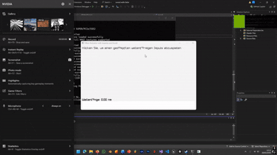

# 🌈 Wave – Light Spectrum Simulation

An interactive physics simulation built with **C++** and **Raylib** that visualizes damped wave impulses, generates real-time audio synthesis, and maps frequency to the visible light spectrum.

---

## 🔬 Project Overview

This project simulates light as a wave using harmonic oscillation and exponential damping.  
When the user clicks, a new wave impulse is generated:

- 🌊 Animated sine wave visualization  
- 🎵 Real-time audio synthesis  
- 🌈 Frequency → Wavelength conversion  
- 🎨 Visible light spectrum color mapping  

The simulation connects mathematics, physics, and graphics programming in real time.

---

## ⚙️ Physics Background

The wavelength is calculated using the formula:

λ = c / f

Where:
- λ = wavelength  
- c = speed of light  
- f = frequency  

The calculated wavelength is converted to nanometers and mapped to a visible color range (380nm – 750nm).

---

## 🧠 Features

- Damped harmonic wave simulation
- Exponential amplitude decay
- Real-time audio stream generation
- Dynamic frequency-to-color mapping
- Interactive mouse-triggered impulses
- Multiple simultaneous wave impulses

---

## 🛠️ Built With

- C++
- Raylib
- Real-time Audio Streaming
- Mathematical wave functions
- Physics-based calculations

---

## 🎮 Controls

| Action | Function |
|--------|----------|
| Left Mouse Click | Generate new wave impulse |

---

## 📊 Technical Highlights

- Custom impulse structure using `std::vector`
- Exponential decay modeling
- Continuous phase tracking for audio synthesis
- Real-time rendering at 60 FPS
- Frequency in the visible light spectrum (~10^14 Hz)

---

## 🚀 How to Run

1. Install Raylib
2. Compile the project:
   ```bash
   g++ main.cpp -o wave -lraylib -lopengl32 -lgdi32 -lwinmm
   ## 📷 Preview


